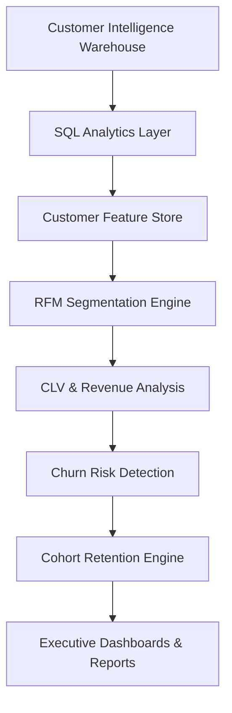
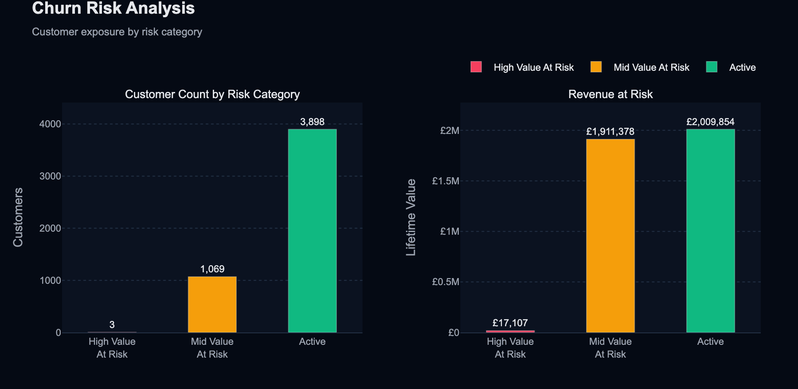
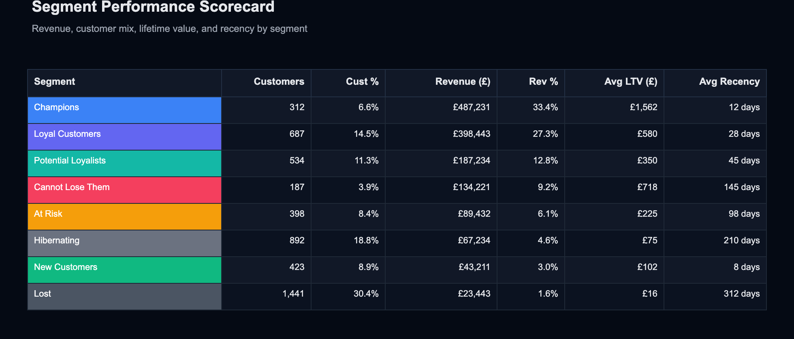
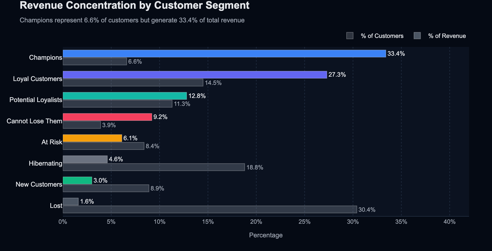
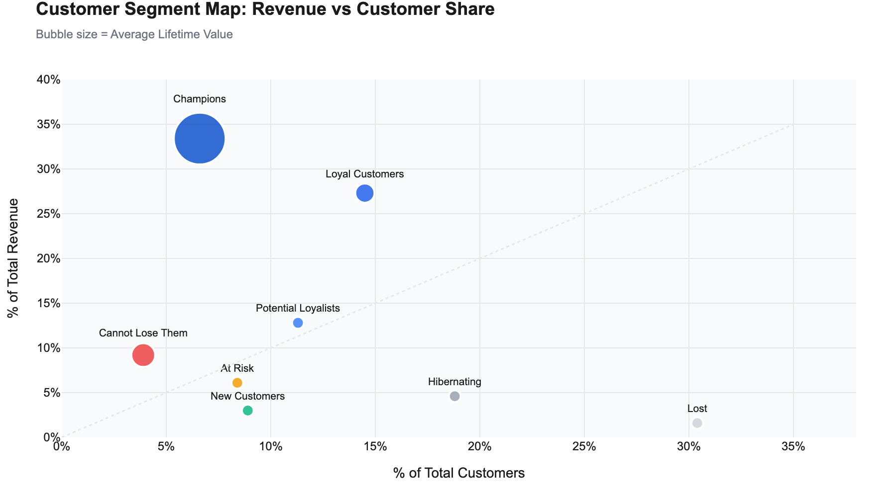
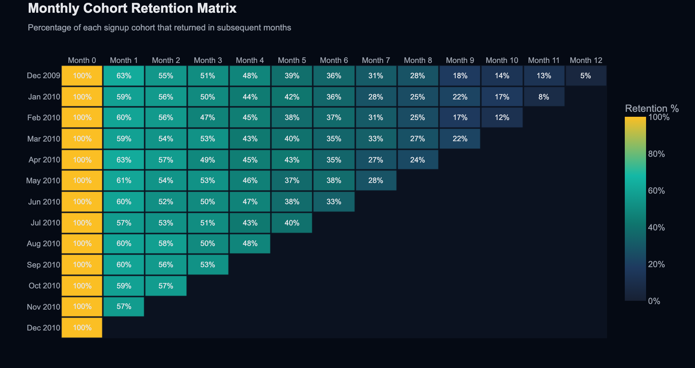

# Customer Segmentation & Retention Intelligence Platform
Customer Analytics, RFM Segmentation, CLV Analysis, Cohort Retention, and Churn Risk Intelligence

An end-to-end customer analytics platform built on top of a production retail data warehouse that transforms transactional purchase data into actionable retention, segmentation, and customer lifetime value insights.

This project combines SQL analytics, behavioral segmentation, cohort retention analysis, churn-risk identification, and executive reporting to help stakeholders answer critical business questions:

- Which customers generate the most revenue?
- Which customers are at risk of churn?
- How concentrated is revenue among customer segments?
- How does retention evolve across customer cohorts?
- Which customer groups should receive retention investment?

The platform analyzes over one million retail transactions and converts raw purchase behavior into business-ready intelligence for customer growth and retention strategies.

---

## Business Problem

Customer acquisition is expensive, and most organizations struggle to identify:
- High-value customers worth retaining.
- Customer segments driving disproportionate revenue.
- Early indicators of customer churn.
- Long-term retention patterns.
- Revenue exposure from inactive customers.

Without a structured segmentation framework, retention efforts become reactive rather than data-driven.

This project builds a customer intelligence layer that quantifies customer value, engagement, retention, and churn risk.

---

## Dataset

The project uses the UCI Online Retail II dataset, containing transactional records from a UK-based online retailer.

### Dataset Profile
- Transactions: 1,062,984+
- Customers: 5,876
- Products: 4,000+
- Countries: 43
- Observation Period: 25 months
- Revenue Analyzed: £2.4M+

Data is sourced from the previously constructed Customer Intelligence Data Warehouse.

---

## Solution Architecture

---

## Core Components

### 1. RFM Segmentation Engine
Customers are scored using:
- Recency
- Frequency
- Monetary Value

Each dimension is ranked and converted into behavioral customer segments.

### Customer Segments
| Segment | Description |
|---|---|
| Champions | Most valuable and highly engaged customers |
| Loyal Customers | Frequent repeat purchasers |
| Potential Loyalists | Emerging high-value customers |
| Cannot Lose Them | Historically valuable but becoming inactive |
| At Risk | Engagement declining |
| Hibernating | Low activity and low value |
| New Customers | Recently acquired |
| Lost | No meaningful recent activity |

### 2. Revenue Concentration Analysis
Measures how revenue is distributed across customer segments.

Example insight:
- Champions represent only **22.1%%** of customers while generating **68.35%** of total revenue.

This helps prioritize retention investment and loyalty programs.

### 3. Customer Lifetime Value Analysis
Calculates:
- Total Spend
- Average Order Value
- Purchase Frequency
- Estimated Customer Lifetime Value

The analysis identifies high-impact customers and revenue drivers.

### 4. Churn Risk Intelligence
Customers are categorized into risk groups using recency and lifetime value signals.

Risk Categories:
- High Value At Risk
- Mid Value At Risk
- Active

Example outcome:
- Identified **£171,101+** in revenue exposure across 15 high-value customers showing 90+ day inactivity.

### 5. Cohort Retention Analytics
Tracks monthly customer cohorts and measures retention over subsequent periods.

Outputs include:
- Retention Matrix
- Cohort Decay Analysis
- Longitudinal Customer Behavior

This enables understanding of customer stickiness and lifecycle dynamics.

---

## Dashboard Components

### Executive Summary
KPIs:
- Total Revenue
- Total Customers
- Average CLV
- Repeat Purchase Rate
- Revenue At Risk

### Customer Segmentation Dashboard
Visualizations:
- Segment Performance Scorecard
- Revenue Contribution by Segment
- Customer Share vs Revenue Share
- Segment Lifetime Value Comparison

### Churn Risk Dashboard
Visualizations:
- Customer Count by Risk Category
- Revenue At Risk Analysis
- High Value Customer Monitoring

### Cohort Retention Dashboard
Visualizations:
- Monthly Cohort Heatmap
- Retention Curve Analysis
- Cohort Performance Trends

---

## Key Insights Generated

### Revenue Concentration
A small percentage of customers generate a disproportionate share of revenue.

### Retention Risk
A subset of historically valuable customers demonstrates declining engagement and elevated churn risk.

### Customer Segmentation
Behavioral segmentation reveals clear differences in value generation, retention, and purchasing frequency.

### Cohort Performance
Retention declines predictably across customer cohorts, highlighting opportunities for lifecycle marketing interventions.

---

## Recommended Business Actions

- Launch retention campaigns for **Cannot Lose Them** customers.
- Create loyalty incentives for **Champions** and **Loyal Customers**.
- Trigger win-back campaigns for **At Risk** and **Hibernating** customers.
- Monitor churn-risk cohorts weekly to reduce revenue exposure.
- Use cohort retention to guide lifecycle marketing timing and budget allocation.

---

## Reports

### Churn Risk Analysis

### Segment Performance Scorecard

### Revenue Concentration

### Segment Bubble

### Cohort Retention Heatmap

## Tech Stack
- Python · pandas · NumPy
- PostgreSQL 15 · Docker
- SQL (Window Functions, CTEs, Cohort Queries)
- Plotly (static chart exports)
- Power BI / Looker Studio