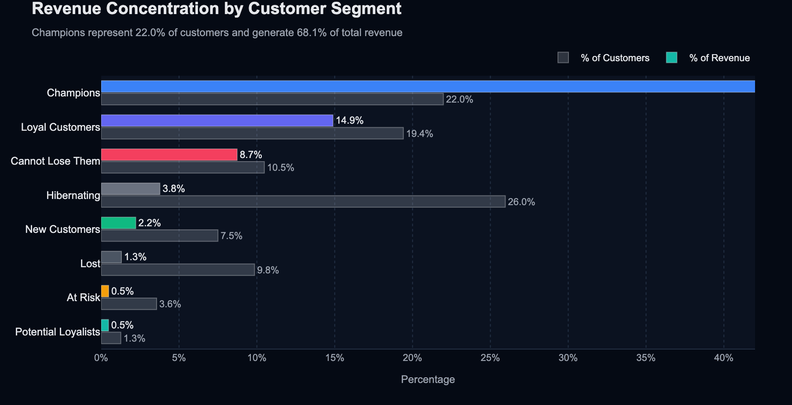
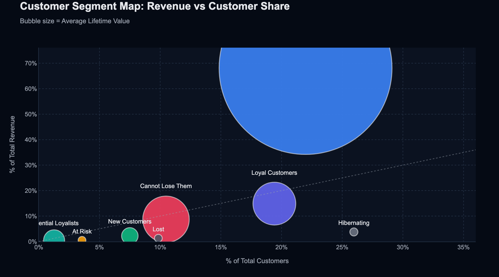
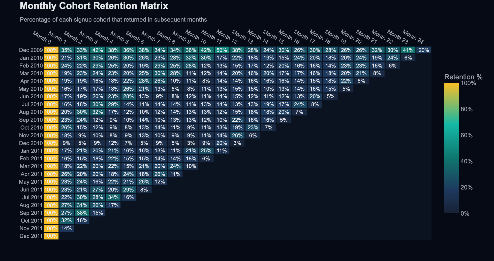
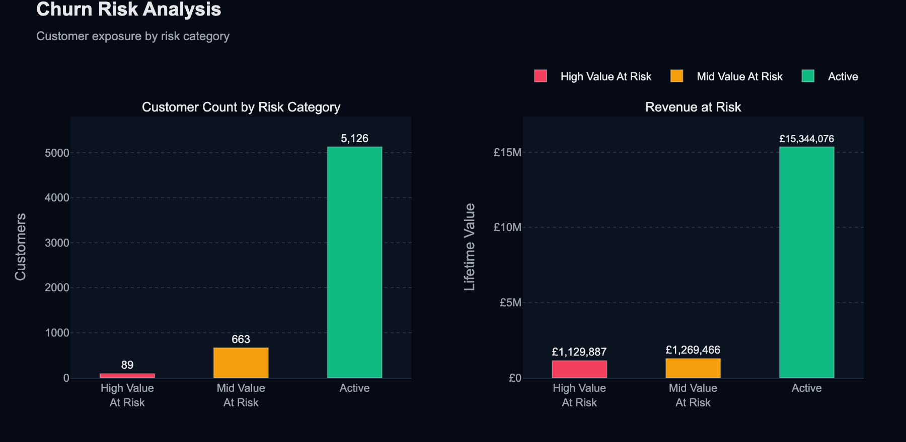
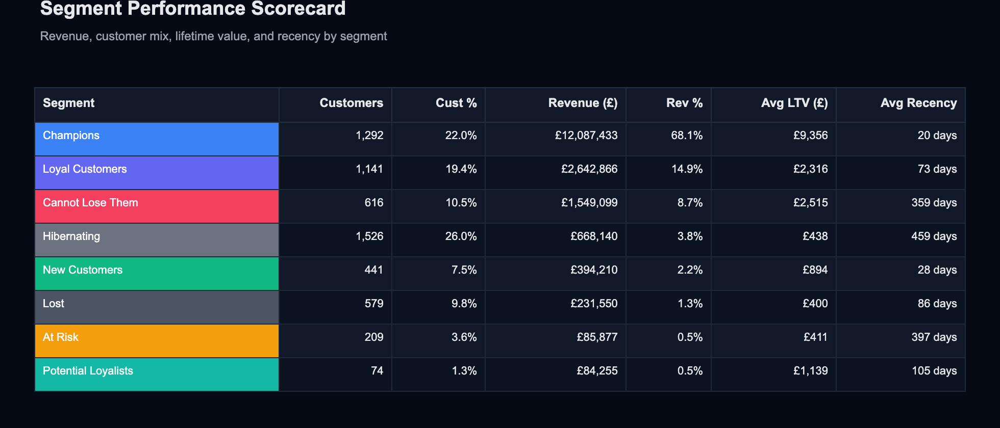
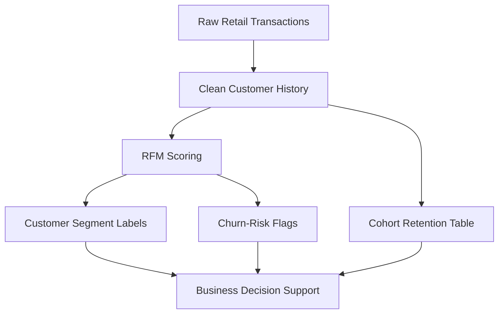
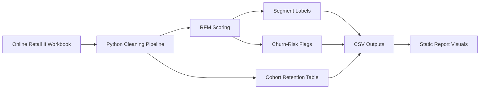

# Customer Segmentation & Retention Intelligence Platform


## Portfolio Highlights

- Analyzed 805,549 cleaned retail transactions from the UCI Online Retail II workbook.
- Segmented 5,878 customers using RFM scoring and rule-based behavioral labels.
- Built churn-risk and cohort-retention outputs to support retention strategy and lifecycle marketing.
- Produced static report visuals that translate customer behavior into business decisions.

## Executive Summary

Customer Segmentation & Retention Intelligence Platform turns historical retail transactions into RFM-based segments, historical customer value summaries, churn-risk flags, cohort retention tables, and report visuals for decision support. It is designed to help teams identify high-value customers, focus retention effort, and understand how engagement changes over time.

The project analyzes 5,878 customers and 805,549 cleaned transactions, with Champions alone accounting for 68.12% of historical revenue. That concentration makes the business value of segmentation and retention planning immediately visible.

## Business Problem

Retail teams need a practical way to understand which customers drive value, which groups are worth retaining, and where customer engagement is weakening.

Without segmentation and retention analysis, marketing spend can become too broad, while high-value customers at risk of inactivity may receive too little attention. This project builds a customer intelligence framework that supports targeted outreach, retention prioritization, and lifecycle planning.

## Key Insights

The outputs support a clear business story.

### Revenue concentration
- Champions: 1,292 customers, 21.98% of customers, 68.12% of revenue, GBP 12,087,432.75 total historical revenue, GBP 9,355.60 average historical value.
- Champions + Loyal Customers: 41.39% of customers, 83.01% of revenue.

### Retention risk concentration
- Cannot Lose Them: 616 customers, 10.48% of customers, 8.73% of revenue, average recency 359.26 days, average historical value GBP 2,514.77.
- Hibernating: 1,526 customers, 25.96% of customers, 3.77% of revenue.
- High Value At Risk: 89 customers, GBP 1,129,887.30 historical value.
- Mid Value At Risk: 663 customers, GBP 1,269,466.07 historical value.

### Cohort retention pattern
- Month 1 average retention: 21.2%.
- Month 2 average retention: 21.9%.
- Month 3 average retention: 21.6%.
- Month 4 average retention: 20.5%.
- Month 5 average retention: 18.8%.
- Month 6 average retention: 17.8%.

These results show that a small share of customers generates most of the value, while a meaningful portion of historical value is concentrated in inactive or declining groups that deserve attention.

## Visual Story

The report visuals provide a fast read on segment value, retention, and churn risk.

### Revenue concentration


### Segment bubble


### Cohort retention heatmap


### Churn risk


### Segment scorecard


## Methodology

The workflow converts purchase history into business-ready outputs using descriptive analytics.

### Core steps
1. Normalize raw column names.
2. Filter invalid and canceled transaction rows.
3. Compute revenue per line item.
4. Build customer-level RFM metrics.
5. Assign segment labels using rule-based business logic.
6. Flag churn-risk groups using recency and historical value thresholds.
7. Build monthly cohort retention tables.
8. Generate static report visuals for interpretation.

RFM scoring is especially useful because it translates transaction history into a practical segmentation system. That helps marketing and customer teams prioritize retention investment, engagement campaigns, and win-back efforts.

### RFM scoring
- Recency: days since the customer’s last purchase.
- Frequency: number of distinct invoices.
- Monetary: total historical revenue.

Each dimension is scored from 1 to 5 using quintiles. Recency is inverse-scored so that more recent customers receive higher scores.

### Segment labels
- Champions.
- Loyal Customers.
- New Customers.
- Potential Loyalists.
- Cannot Lose Them.
- At Risk.
- Hibernating.
- Lost.

### Churn-risk logic
- High Value At Risk: monetary > 5000 and recency > 90.
- Mid Value At Risk: monetary between 1000 and 5000 and recency > 120.
- Active: default label.

### Cohort retention
Customers are grouped by first purchase month and tracked across subsequent months to show how retention changes over time.


```mermaid
flowchart TD
    A[Raw Retail Transactions] --> B[Clean Customer History]
    B --> C[RFM Scoring]
    C --> D[Customer Segment Labels]
    C --> E[Churn-Risk Flags]
    B --> F[Cohort Retention Table]
    D --> G[Business Decision Support]
    E --> G
    F --> G
```

## Architecture


```mermaid
flowchart LR
    A[Online Retail II Workbook] --> B[Python Cleaning Pipeline]
    B --> C[RFM Scoring]
    C --> D[Segment Labels]
    C --> E[Churn-Risk Flags]
    B --> F[Cohort Retention Table]
    D --> G[CSV Outputs]
    E --> G
    F --> G
    G --> H[Static Report Visuals]
```

This project is intentionally built as a reproducible local analytics workflow rather than a deployed system. The repository focuses on customer intelligence outputs that can be reviewed, shared, and used for portfolio storytelling.

## Repository Structure

```text
.
├── README.md
├── requirements.txt
├── data/
│   ├── raw/
│   │   └── online_retail_II.xlsx
│   └── processed/
│       ├── churn_risk.csv
│       ├── churn_risk_high_value.csv
│       ├── cohort_retention.csv
│       ├── rfm_segments.csv
│       └── segment_summary.csv
├── reports/
│   ├── 01_revenue_concentration.png
│   ├── 02_segment_bubble.png
│   ├── 03_cohort_retention_heatmap.png
│   ├── 04_churn_risk.png
│   └── 05_segment_scorecard.png
├── sql/
│   └── analytics/
│       ├── churn_risk.sql
│       └── cohort_retention.sql
└── src/
    ├── rfm_segmentation.py
    └── visualize.py
```

## How to Run

Install dependencies:

```bash
pip install -r requirements.txt
```

Generate processed data:

```bash
python src/rfm_segmentation.py
```

Generate report images:

```bash
python src/visualize.py
```

### External requirements
- Python environment with packages from `requirements.txt`.
- Raw dataset file at `data/raw/online_retail_II.xlsx`.
- Brave Browser for static PNG export.

## Technologies Used

- Python.
- pandas.
- NumPy.
- openpyxl.
- Plotly.
- Kaleido 1.3.0.
- Brave Browser for static PNG export.
- SQL files as illustrative examples only.

## Limitations

- No machine learning.
- No predictive churn model.
- No predictive CLV model.
- Churn-risk flags are rule-based.
- Segment assignment is rule-based and depends on chosen thresholds.
- Static reports require Brave Browser for Kaleido image export.
- SQL files are illustrative examples and are not connected to a live database in this repository.
- Dataset is historical retail transaction data, not live production data.
- Returns and cancellations are excluded by filtering invoices beginning with `C` and non-positive quantities or prices.
- Raw data file must be present locally at `data/raw/online_retail_II.xlsx`.